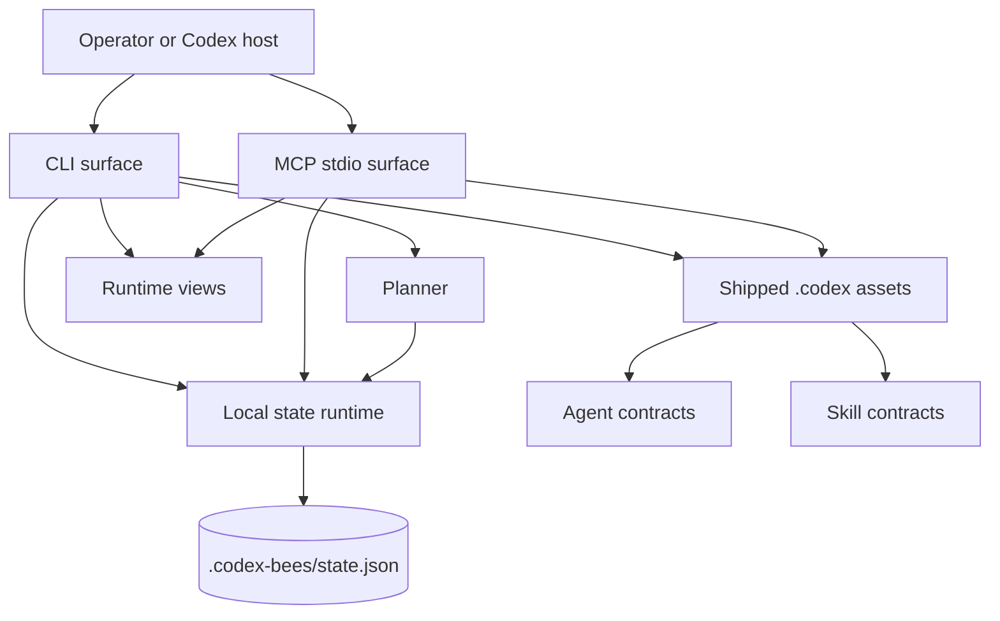

# Architecture

## Positioning

`codex-bees` is a **Codex-only, local bounded orchestration kernel**.

It is designed to ship a small, inspectable coordination surface for explicit multi-agent work inside one repository. It is **not** a hosted control plane, a cross-machine federation layer, or a generic plugin-market product.

## Shipped product boundary

### Shipped surface

- the `codex-bees` CLI
- the `codex-bees mcp --stdio` MCP server
- the `.codex` bootstrap payload installed by `codex-bees init`
- the shipped agent contracts in `.codex/agents/`
- the shipped skill contracts in `.codex/skills/`
- the local state runtime under `.codex-bees/state.json`
- the public JavaScript entrypoints exposed from `dist/`

### Repo-internal implementation surface

These exist to build and verify the product, but are not the product boundary themselves:

- `src/` implementation modules
- `scripts/` build, type, and smoke tooling
- `.omx/` planning and execution history
- repo-only generated artifacts such as local tarballs

## Layer model

| Layer | Purpose | Primary files |
| --- | --- | --- |
| CLI | Human/operator entry surface | `src/index.js`, `src/state/cli/*` |
| MCP | Tool-driven stdio JSON-RPC surface | `src/mcp.js`, `src/state/mcp/*` |
| Planning | Turn one objective into bounded lanes | `src/planner.js`, `src/planner-*` |
| Coordination state | Persist tasks, swarms, memory, and lifecycle transitions | `src/state-*.js`, `.codex-bees/state.json` |
| Runtime views | Read-oriented dashboards, packs, and handoff bundles | `src/runtime-*.js`, `src/state-runtime-*` |
| Catalog | Discover shipped skills and agents | `src/catalog-*.js`, `.codex/` |
| Workspace assets | Codex-specific repo bootstrap payload | `.codex/config.toml`, `.codex/agents/*`, `.codex/skills/*` |

## High-level system view



## Filesystem model

```text
.codex/
  config.toml
  agents/
    explore.md
    executor.md
    reviewer.md
    tester.md
  skills/
    project-development/SKILL.md
    swarm-orchestration/SKILL.md

.codex-bees/
  state.json
```

## Design choices

### 1. Codex-only first

The runtime contract explicitly optimizes for Codex-native workflows. The first version does not preserve multi-host abstraction at the expense of clarity.

### 2. Local state, local transport

The runtime keeps orchestration state in one local JSON store and exposes two primary transports:

- CLI over stdio
- MCP over stdio JSON-RPC

### 3. Explicit ownership over opaque autonomy

The system is built around:

- one active writer per file
- owner/verifier role separation
- bounded tasks and swarms
- fresh verification before closure

### 4. Product surface over admin residue

The repository should keep user-facing runtime code, docs, skills, and agent contracts. Planning archives, migration diaries, and tracker residue are not meant to define the public product identity.

## Why this is not a federation layer

`codex-bees` intentionally stays on the smaller side of the design space:

- local queue, not cross-machine federation
- bounded contracts, not open-ended meta-harness behavior
- inspectable state, not opaque orchestration memory
- Codex-first bootstrap assets, not multi-host packaging

That boundary is a product decision, not a missing implementation detail.
