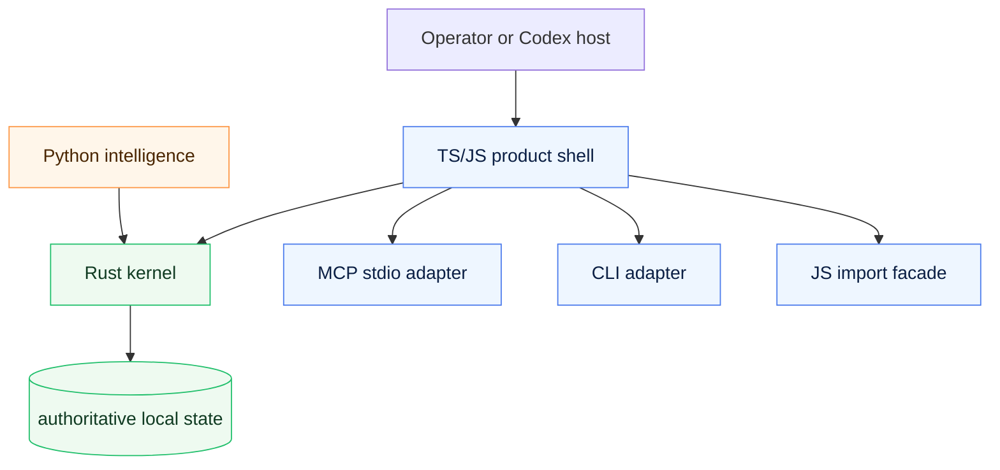

# Hybrid runtime strategy

## Status

This document is a **forward-looking strategy** for a later runtime layering effort.

It does **not** authorize an immediate rewrite. It defines the constraints that any later migration must satisfy so `codex-bees` can evolve without losing its current product truth.

## Executive summary

`codex-bees` should remain a **Codex-only, local bounded orchestration kernel** even if the implementation later becomes multi-language.

The recommended long-term direction is:

- **Rust** owns persisted truth and legal state transitions
- **Python** owns optional intelligence and policy experimentation
- **TS/JS** owns the product shell: npm packaging, CLI, MCP, imports, and bootstrap assets

Short form:

> Python suggests. Rust commits. TS/JS ships.

## Current product promise that must not regress

The current product contract is:

- local bounded orchestration, not a hosted control plane
- Codex-only first-pass runtime boundary
- CLI and MCP stdio as the primary transports
- npm package + JS import surface as part of the shipped product
- explicit ownership, verifier separation, and inspectable local state

Any future runtime split must preserve:

1. the local bounded product identity
2. the Codex-only boundary
3. the CLI command surface
4. the MCP stdio behavior
5. current npm exports and JS import expectations

## Why consider a hybrid runtime at all?

The current repo already has a clear product shell and a growing runtime surface.

Reasons to consider layering later:

- persisted state and legal transitions benefit from a harder ownership boundary
- adaptive planning and ranking logic may evolve at a different speed than truth
- product packaging and host-facing compatibility should remain stable even if internals change

Reasons **not** to rush:

- a rewrite can easily create a second source of truth
- packaging complexity can overshadow product value
- language migration before boundary extraction would create churn without clarity

## Non-goals

This strategy does **not** target:

- multi-host orchestration in the first pass
- a hosted backend or remote control plane
- cross-machine federation as a product requirement
- a full language rewrite driven by taste alone

## Target architecture

## Layer ownership matrix

| Capability | Rust kernel | Python intelligence | TS/JS shell |
| --- | --- | --- | --- |
| Persisted state | owner | read-only | read via contract |
| Task/swarm legality | owner | suggest only | route only |
| Transition validation | owner | suggest only | route only |
| Event history | owner | read-only | render/export |
| Planner heuristics | no | owner | temporary fallback until extracted |
| Memory ranking policy | no | owner | temporary fallback until extracted |
| Prioritization experiments | no | owner | no |
| CLI command surface | no | no | owner |
| MCP stdio adapter | no | no | owner |
| npm exports/import facade | no | no | owner |
| init/bootstrap surface | no | no | owner |
| Docs/skills/agents packaging | no | no | owner |

## Inter-layer contract

### Hard rules

1. **There is exactly one authoritative runtime source of truth.**
2. Python must never write persisted runtime state directly.
3. TS/JS must never become a hidden second kernel.
4. All authoritative writes must flow through the kernel contract.

### Expected contract shape

The first kernel contract should be small and explicit:

- load authoritative state
- validate one requested transition
- apply one authoritative transition
- return normalized mutation result + reason + errors
- expose stable read models where truth-dependent projections are required

### Contract assumptions

- payloads stay machine-readable and schema-versioned
- kernel errors are structured, not shell-specific
- the JS shell remains responsible for CLI/MCP presentation
- optional Python services consume contracts, not internal files

## Migration phases

### Phase 0 — Boundary extraction in JS

Extract clean truth/policy/shell seams without changing the product promise.

Exit criteria:

- state truth APIs are explicit
- shell-only concerns are clearly separated
- heuristics and projections are distinguishable from legal state transitions

### Phase 1 — Contract freeze and schema fixtures

Define stable request/response and state-shape fixtures before any cross-language port.

Exit criteria:

- mutation/result schemas are frozen
- representative fixtures exist for lifecycle flows
- compatibility expectations are written down

### Phase 2 — Rust kernel MVP

Port the smallest authoritative truth slice first.

Recommended first kernel boundary:

- persisted state loading/saving
- task lifecycle legality
- swarm lifecycle legality
- claim/review/release validation

Exit criteria:

- authoritative writes can run through the kernel
- JS shell remains externally compatible
- there is still only one source of truth

### Phase 3 — JS shell adapts to kernel

Keep CLI, MCP, npm exports, and bootstrap surfaces stable while swapping the authoritative backend.

Exit criteria:

- CLI continuity preserved
- MCP continuity preserved
- JS import surface preserved or compatibility-shimmed

### Phase 4 — Optional Python intelligence layer

Add Python only after the kernel contract exists and is stable enough to consume.

Exit criteria:

- Python remains optional
- Python owns strategy, not truth
- disabling Python does not break the product shell

### Phase 5 — Cleanup and deprecation

Remove obsolete JS truth paths only after the kernel path is proven and compatibility is maintained.

Exit criteria:

- deprecated duplicate logic removed
- compatibility notes updated
- no shadow state path remains

## Migration gates

These gates are mandatory:

- no Rust port before JS boundary extraction
- no Python intelligence layer before the kernel contract exists
- no public-surface churn without a compatibility plan
- no second source of truth

## Compatibility and packaging strategy

The following surfaces must be treated as product contracts:

- CLI entrypoints
- MCP stdio behavior
- npm package install behavior
- current subpath exports
- JS programmatic import expectations

Expected tradeoffs:

- multi-language packaging becomes more complex
- build and release workflows become heavier
- debugging can cross language boundaries

Those costs are acceptable only if truth ownership becomes materially clearer.

## Risks and mitigations

| Risk | Why it matters | Mitigation |
| --- | --- | --- |
| Dual source of truth | invalidates the kernel boundary | forbid direct non-kernel authoritative writes |
| Hidden policy duplication | makes behavior drift silently | document owner for each capability |
| Public contract drift | breaks real users of the shell | freeze compatibility expectations before migration |
| Premature Python | turns optional intelligence into hidden dependency | add Python only after kernel contract exists |
| Premature Rust port | ports entangled logic instead of clean boundaries | boundary extraction first |
| Tooling complexity > product value | migration becomes self-serving | require product-facing justification per phase |

## Open questions

These should be resolved before any language implementation phase starts:

1. what exact mutation boundary becomes the first kernel slice?
2. what transport should the JS shell use to talk to the kernel?
3. does Python ship as optional tooling or as a bundled first-party extra?
4. what evidence qualifies the kernel as stable enough before adding adaptive planning?

## ADR summary

### Decision

Adopt a phased hybrid-runtime strategy where Rust eventually owns truth, Python may own optional intelligence, and TS/JS remains the product shell.

### Drivers

- protect current product identity
- harden truth ownership
- preserve CLI/MCP/npm compatibility
- keep adaptive intelligence subordinate to truth

### Rejected alternatives

- **stay JS forever** — simplest operationally, but does not by itself solve future truth-boundary concerns
- **rewrite fully in Python** — strong intelligence ecosystem, but wrong place for authoritative runtime truth
- **rewrite fully in Rust immediately** — strong invariants, but too disruptive before boundaries are extracted

### Consequences

- migration becomes slower and more disciplined
- compatibility becomes a first-class design constraint
- kernel work cannot start until boundary extraction and contract freezing are done

### Follow-ups

1. publish a migration matrix
2. publish a boundary review checklist
3. identify the first kernel boundary explicitly
4. freeze the first contract fixture set before any porting work
